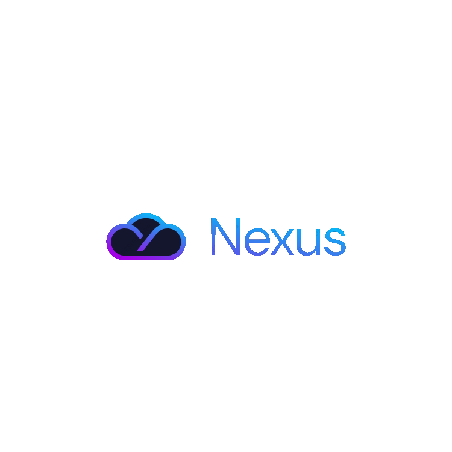

    

# Nexus - Your Ultimate Productivity Hub

 

[![Badge License]][License] 

 
Welcome to Nexus, your ultimate productivity companion! Nexus is a versatile note-taking and organization app designed to help you streamline your workflow, capture ideas, and stay organized.
 
 

- **Notes**: Capture your thoughts, ideas, and important information effortlessly.
- **Tasks**: Keep track of your tasks and manage your to-do lists efficiently.
- **Projects**: Organize your work into projects to maintain clarity and focus.
- **Collaboration**: Share notes, tasks, and projects with teammates for seamless collaboration.
- **Customization**: Customize your workspace with colors, tags, and labels to suit your preferences.
- **Cross-Platform**: Access Nexus from your desktop, browser, or mobile device, ensuring you stay productive wherever you go.

## Getting Started

To get started with Nexus, follow these simple steps:

1. **Sign Up**: Create an account on Nexus by visiting [nexusapp.com](https://www.nexusapp.com) or downloading the Nexus app from your app store.
2. **Explore Features**: Familiarize yourself with the different features of Nexus, including notes, tasks, and projects.
3. **Create Your Workspace**: Set up your workspace by organizing your notes, tasks, and projects according to your workflow.
4. **Invite Collaborators**: If you're working with a team, invite collaborators to share and collaborate on notes and projects.
5. **Start Productivity**: Begin using Nexus to capture ideas, manage tasks, and enhance your productivity!

## Implementation
| Features              | Status                   |
| --------------        | -------------------------------- |
| Database              | -  [x]  |
| Pages                 | -  [x]  |
| Note taking           | -  [x]  |
| Todo                  | -  [x]  |
| GUI                   | -  [x]  |
| Multi-User            | -  [x]  |
| Login                 | -  [x]  |
| Register              | -  [x]  |
| Splash screen         | -  [V] |
| Online publication    | -  [x]  |
| Dark mode             | -  [x]  |
| Settings              | -  [x]  |

## Documentation

For detailed documentation on how to use Nexus, refer to the [User Guide](https://www.nexusapp.com/docs) available on our website.

## Feedback and Support

We value your feedback! If you have any questions, suggestions, or encounter any issues while using Nexus, please don't hesitate to [contact our support team](mailto:support@nexusapp.com).

## Contributing

Contributions are welcome! If you're interested in contributing to Nexus, please refer to our [Contribution Guidelines](CONTRIBUTING.md) for more information.

## License

This project is licensed under the MIT License - see the [LICENSE](LICENSE) file for 

---

Happy organizing and stay productive with Nexus!

<!----------------------------------{ Badges }--------------------------------->

[Badge License]: https://img.shields.io/github/license/Ciollo/Nexes
